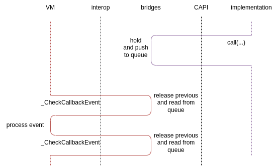

# Callbacks

## Understanding of Callbacks

Here you can find examples of callbacks usage in CAPI with simple examples and list of common problems.

### Terms

**Resource** (or **CallbackResource**) - set of numeric identifier `resourceId` (currently int32), `hold` and `release` functional pointers with signature `void(int32)`.

* resourceId - unique identifier of resource, purpose of which is defined by the Resource creator. For example, for managed side callbacks resourceId might be a key in a map `Map<int, () => void>`, where each resourceId corresponds to on closure.
* hold - function, that is being called to increment references count to the Resource.
* release - function, that is being called to decrement references count to the Resource.

Exact implementation of hold and release is specific for the one who creates Resource.

**Callback** - set of Resource, `call` and `callSync` functional pointers. Signature of `callSync` is `void (VMContext vmContext, int32 resourceId, [callbackArg0, ..., callbackArgN] [ContinuationType continuation])`. Signature of `callSync` is exact `call` without vmContext argument.

**VMContext** - context of virtual machine, that comes in some API calls. Used for calls to VM through napi/ani/ets_napi/etc (depending on kind of virtial machine). CAPI does not provides any information about what VMContext is exactly.

**continuation** - callback, that will be called to provide result of parent's Callback execution in reactive style.

### Hold, Release and call context <a id='hold-release-and-call-context'></a>

C language does not have builtin ways to track references count for data, just functions with pure data. Because of that you must always carefully control, have you incremented references with `hold` function or not. <a id='callback-context-convention'></a>By the convention, if structure with Resource is passed in function arguments, references counter will always be not zero to give you a change to control a Resource. But if you want to keep resource out of function context, you must manually call `hold` function.

Correct usage (callback was called inside `foo` context, where refs count was not zero):

```c++
typedef struct Callback_Void {
    CallbackResource resource;
    void (*call)(int32_t resourceId);
    void (*callSync)(VMContext vmContext, int32_t resourceId);
} Callback_Void;

void foo(const Callback_Void *cb) {
    cb->call(cb->resource.resourceId); // refs count > 0 because of context
    cb->call(cb->resource.resourceId); // refs count > 0 because of context
}
```

Correct usage - callback was called out of `subscribe` context, but hold has been called. After callback is no more needed, release has been called:

```c++
bool g_isValid = false;
Callback_Void g_cb;
void subscribe(const Callback_Void *cb) {
    g_cb = *cb; // refs count > 0 because of context
    g_isValid = true; // refs count > 0 because of context
    g_cb.resource.hold(g_cb.resource.resourceId) // holding
}
void emit() {
    if (g_isValid) {
        g_cb.call(g_cb.resource.resourceId); // holding
    }
}
void unsibscribe(const Callback_Void *cb) {
    if (g_isValid) {
        g_isValid = false; // holding
        g_cb.resource.release(g_cb.resource.resourceId) // released, refs count unspecified
    }
}
```

Incorrect usage - pointer to the resource was saved instead of structure data. Remember, that pointers in CAPI arguments are used just to optimize size of passed data:

```c++
bool g_isValid = false;
const Callback_Void *g_cb;
void subscribe(const Callback_Void *cb) {
    g_cb = cb;
    g_isValid = true;
    // ...
}
void emit() {
    if (g_isValid) {
        g_cb->call(g_cb->resource.resourceId); // g_cb points to a memory, that is not guaranteed to be valid
    }
}
```

Incorrect usage - hold was not called and callback is used out of `subscribe` context:

```c++
bool g_isValid = false;
Callback_Void g_cb;
void subscribe(const Callback_Void *cb) {
    g_cb = *cb; // refs count > 0 because of context
    g_isValid = true; // refs count > 0 because of context
}
void emit() {
    if (g_isValid) {
        cb->call(cb->resource.resourceId); // refs count unspecified
    }
}
```

### Creating your own callback

Callbacks are based on very primitive rules, but using different wrappers you can write readable code. Here is the simplest example of how you can create callback from c++ lambda expression:

```c++
typedef struct Callback_Int32_Void {
    CallbackResource resource;
    void (*call)(int32_t resourceId, int32_t value);
    void (*callSync)(VMContext vmContext, int32_t resourceId, int32_t value);
} Callback_Int32_Void;

struct CallbackInfo {
    std::function<void(int32_t)> handler;
    int32_t counter = 0;
};

int32_t g_nextResourceId = 1;
std::map<int32_t, CallbackInfo> g_resouceIdToCallback;

void holdImpl(int32_t resourceId) {
    g_resouceIdToCallback[resourceId].counter++;
}

void releaseImpl(int32_t resourceId) {
    g_resouceIdToCallback[resourceId].counter--;
    if (g_resouceIdToCallback[resourceId].counter == 0)
        g_resouceIdToCallback.erase(resourceId);
}

void callImpl(int32_t resourceId, int32_t value) {
    g_resouceIdToCallback[resourceId](value);
}

void callSyncImpl(VMContext _, int32_t resourceId, int32_t value) {
    g_resouceIdToCallback[resourceId](value);
}

Callback_Int32_Void lambdaToCallback(std::function<void(int32_t)>&& lambda) {
    int32_t resourceId = g_nextResourceId++;
    g_resouceIdToCallback[resourceId] = {
        lambda,
        1,
    };
    return {
        {   // CallbackResource
            resourceId,     // resourceId
            holdImpl,       // hold
            releaseImpl,    // release
        },
        callImpl,       // call
        callSyncImpl,   // callSync
    }
}

void subscribe(const Callback_Int32_Void *cb) {
    // do something
}

void main() {
    Callback_Int32_Void cb = lambdaToCallback([](int32_t value) {
        printf("%d\n", value);
    })
    subscribe(&cb);
    cb.resource.release(cb.resource.resourceId);
}
```

That code is the most primitive thing that you can do. Using C++ templates you can create much more comfortable wrappers, like in arkui_ace_engine (see [callback_helper.h](https://gitee.com/openharmony/arkui_ace_engine/blob/OpenHarmony_ArkUI_Upstream_2024/frameworks/core/interfaces/native/utility/callback_helper.h), [callback_keeper.h](https://gitee.com/openharmony/arkui_ace_engine/blob/OpenHarmony_ArkUI_Upstream_2024/frameworks/core/interfaces/native/utility/callback_keeper.h)).

### Continuations <a id='continuations'></a>

Continuation is a way to deliver callback execution result to the caller. Essentially continuations are just a representation of return type in reactive style.

Let's imagine that there is IDL callback declaration:

```
callback Foo = i32 ();
```

For TypeScript that type can be represented like:

```typescript
type Foo = () => number
```

For this callback valid generation in CAPI will be:

```c++
typedef struct Callback_Int32_Void {
    CallbackResource resource;
    void (*call)(int32 resourceId, int32 value);
    void (*callSync)(VMContext vmContext, int32 resourceId, int32 value);
} Callback_Number_Void;

typedef struct Foo {
    CallbackResource resource;
    void (*call)(int32 resourceId, Callback_Int32_Void continuation);
    void (*callSync)(VMContext vmContext, int32 resourceId, Callback_Int32_Void continuation);
} Foo;
```

You can see, that for Foo struct there is `continuation` arguments in call and callSync fields, and it's type is callback with single argument, typed same as return type in source IDL declaration.

Usage:

```c++
void foo(Foo cb) {
    Callback_Int32_Void continuation = lambdaToCallback([](int32_t value) {
        printf("%d\n", value);
    });
    cb.call(cb.resourceId, continuation);
    continuation.resource.release(continuation.resource.resourceId);
}
```

### Synchronous calls

Each callback has two functions: call and callSync. The first one is asynchronous - it can be queued and executed later as so as continuation argument. That approach is good in most of cases because of reducing back calls to VM and better multithreading optimizations. But sometimes you need to receive call result immediately - there `callSync` comes.

Sync calls signatures has required `VMContext` argument. It can not be retrieved at any time you want and available only inside calls from VM:

```c++
Callback_Void g_cb;
void foo(VMContext vmContext) {
    g_cb.callSync(g_cb.resourceId, vmContext);
    g_cb.callSync(g_cb.resourceId, vmContext);
}
```


Storing VMContext globally and then using it can result with unpredictable behaviour, so be careful with that. 

```c++
VMContext g_vmContext;
void foo(VMContext vmConvext) {
    g_vmContext = vmContext; // do not do that
}

Callback_Void g_cb;
void boo() {
    g_cb.callSync(g_cb.resourceId, g_vmContext); // do not do that
}
```

The best decision will be to use asynchronous call, otherwise you must explicitly request VMContext in api.

```c++
void boo() {
    // the best
    g_cb.call(g_cb.resourceId, g_vmContext);
}
void boo(VMContext vmContext) {
    // affects optimization, but acceptable too
    g_cb.callSync(g_cb.resourceId, vmContext);
}
```

<div style="page-break-before:always"></div>

## Managed & Bridges callbacks

### Overview

There is presented general callback pipelines - how callbacks are transferred between managed and native, how transferred their calls and so on.

Traversing managed closure to native CAPI structure.

1. Have managed closure with known signature.
2. Closure is registered in ResourceHolder and transformed to primitive type values (see [Managed: closure serialization](#managed-closure-serialization)).
3. In native call, callSync, hold and release are filled with functional pointers (see [Bridges: hold and release](#bridges-hold-release), [Bridges: call and callSync](#bridges-call-callSync)).
4. Callback structure in CAPI terms has been passed to appropriate CAPI method call.

Converting native CAPI structure to managed closure.

1. Have some serialized callback - set of resourceId, hold, release, call and callSync values.
2. Those values are read and managed closure is created. Inside closure arguments are serialized and with callback info passed to `_CallCallbackSync` or `_CallCallback`. See [Managed: closure deserialization](#managed-closure-deserialization).
3. Closure is ready to be called.

Calling callback in CAPI, that was created from managed closure.

1. Have CAPI structure describing callback, that came from managed side. `call` or `callSync` has beed invoked.
2. `callManagedSmth` or `callManagedSmthSync` (that call or callSync essentially is, see [Bridges: call and callSync](#bridges-call-callSync)) is invoked. 
3. Callback arguments are serialized. Depending on synchronous or asynchronous call managed function is invoked or callback is put into queue and called later (see [Bridges: general events](#bridges-general-events)).
4. After receiving callback arguments in managed side, they are deserialized, closure instance is got from ResourceHolder and called (see [Managed: deserialize arguments and call closure](#managed-deserialize-and-call)). If there is not void return type in closure, continuation callback is called with received result (see [Continuations](#continuations)).

Calling callback in managed, that was deserialized from CAPI representation.

1. Have managed closure converted from CAPI structure. Closure is invoked.
2. Closure arguments are serialized and `_CallCallbackSync` or `_CallCallback` is invoked. See [Managed: closure deserialization](#managed-closure-deserialization)
3. In native arguments are deserialized and `call` or `callSync` of initial CAPI representation is invoked. See [Bridges: deserialize arguments and call closure](#native-deserialize-and-call)

### Managed: closure serialization <a id='managed-closure-serialization'></a>

In managed side callbacks are just closures. So, before passing it through interop we need to represent it in CAPI-like data with Resouce, call and callSync.

```
// idl
callback Foo = void ();
void foo(Foo cb);
```

Here is global function `foo` declared via IDL with functional type argument `Foo cb`. Typescript implementation for this function will look like:

```typescript
// typescript
function foo(cb: Foo): void {
    const thisSerializer: Serializer = Serializer.hold()
    thisSerializer.holdAndWriteCallback(cb)
    OHOSNativeModule._GlobalScope_foo(thisSerializer.asBuffer(), thisSerializer.length())
    thisSerializer.release()
}
```

Currently serialization into buffer is a way to pass non-primitive data through the interop. So, callback is being written to Serializer with holdAndWriteCallback function:

```typescript
class SerializerBase {
    // ...
    holdAndWriteCallback(callback: object, hold: KPointer = 0, release: KPointer = 0, call: KPointer = 0, callSync: KPointer = 0): ResourceId {
        const resourceId = ResourceHolder.instance().registerAndHold(callback)
        this.heldResources.push(resourceId)
        this.writeInt32(resourceId)
        this.writePointer(hold)
        this.writePointer(release)
        this.writePointer(call)
        this.writePointer(callSync)
        return resourceId
    }
    // ...
}
```

Let's look at this function line by line.

```typescript
const resourceId = ResourceHolder.instance().registerAndHold(callback)
```

TypeScript closure here is being transformed into some resourceId. ResourceManager is very simple class that allows to link some managed side object with unique identifier and count references count to this identifier:

```typescript
export type ResourceId = int32

interface ResourceInfo {
    resource: object
    holdersCount: int32
}

export class ResourceHolder {
    private static nextResourceId: ResourceId = 100
    private resources: Map<ResourceId, ResourceInfo> = new Map<ResourceId, ResourceInfo>()

    public hold(resourceId: ResourceId) {
        if (!this.resources.has(resourceId))
            throw new Error(`Resource ${resourceId} does not exists, can not hold`)
        this.resources.get(resourceId)!.holdersCount++
    }

    public release(resourceId: ResourceId) {
        if (!this.resources.has(resourceId))
            throw new Error(`Resource ${resourceId} does not exists, can not release`)
        const resource = this.resources.get(resourceId)!
        resource.holdersCount--
        if (resource.holdersCount <= 0)
            this.resources.delete(resourceId)
    }

    public registerAndHold(resource: object): ResourceId {
        const resourceId = ResourceHolder.nextResourceId++
        this.resources.set(resourceId, {
            resource: resource,
            holdersCount: 1,
        })
        return resourceId
    }

    public get(resourceId: ResourceId): object {
        if (!this.resources.has(resourceId))
            throw new Error(`Resource ${resourceId} does not exists`)
        return this.resources.get(resourceId)!.resource
    }

    public has(resourceId: ResourceId): boolean {
        return this.resources.has(resourceId)
    }
}
```

<a id='serializer-hold-and-write'></a>In `this.heldResources.push(resourceId)` held resource is being remembered, because it [must be released](#serializer-release-explanation) after interop function call. Do you remember a [rule](#callback-context-convention) that callback must have valid references count in a call context? Here call context is invocation of interop `OHOSNativeModule._GlobalScope_foo` function, and release must be executed after that. `heldResources` array just says, what resources we have held.

Following lines is exact serialization data of callback:

```typescript
this.writeInt32(resourceId)
this.writePointer(hold)
this.writePointer(release)
this.writePointer(call)
this.writePointer(callSync)
```

As you can see, resourceId is valid number, but for hold, release, call and callSync were used defaults `nullptr` values. The reason - all of them must be pointers to some native functions, and we will fill those fields on deserialization in native side, where we can revrieve native functions address:

```c++
// SerializerBase.h
class SerializerBase {
    // ...
    InteropCallbackResource readCallbackResource() {
        InteropCallbackResource result = {};
        result.resourceId = readInt32();
        result.hold = reinterpret_cast<void(*)(InteropInt32)>(readPointerOrDefault(reinterpret_cast<void*>(holdManagedCallbackResource)));
        result.release = reinterpret_cast<void(*)(InteropInt32)>(readPointerOrDefault(reinterpret_cast<void*>(releaseManagedCallbackResource)));
        return result;
    }
    // ...
}

// bridge.cc

void impl_GlobalScope_foo(KSerializerBuffer thisArray, int32_t thisLength) {
    Deserializer thisDeserializer(thisArray, thisLength);
    OHOS_Foo cb_value = {
        thisDeserializer.readCallbackResource(), 
        reinterpret_cast<void(*)(const OH_Int32 resourceId)>(thisDeserializer.readPointerOrDefault(reinterpret_cast<OH_NativePointer>(getManagedCallbackCaller(Kind_Foo)))), 
        reinterpret_cast<void(*)(OH_OHOS_VMContext vmContext, const OH_Int32 resourceId)>(thisDeserializer.readPointerOrDefault(reinterpret_cast<OH_NativePointer>(getManagedCallbackCallerSync(Kind_Foo))))};;
    GetOH_OHOS_API(OHOS_API_VERSION)->GlobalScope()->foo((const OHOS_Foo*)&cb_value);
}
KOALA_INTEROP_DIRECT_V2(GlobalScope_foo, KSerializerBuffer, int32_t)
```

Going back to `foo` implementation in managed side, the next line is call of interop `_GlobalScope_foo` function:

```typescript
OHOSNativeModule._GlobalScope_foo(thisSerializer.asBuffer(), thisSerializer.length())
```

That is the entry point to native, where serialized data is being deserialized, transformed to CAPI structures and then CAPI appropriate method is being called.

<a id='serializer-release-explanation'></a>Last line releases resources that [were held](#serializer-hold-and-write) while calling `holdAndWriteCallback`:

```typescript
thisSerializer.release()
```

### Managed: closure deserialization <a id='managed-closure-deserialization'></a>

While serialized closures are always set of resourceId and functional pointers and there is no separation between managed or native created callbacks (at the moment of writing this document). 

Source callback declaration:
```
// .idl
callback Foo = void (number value);
```

Generated deserialization code:
```typescript
class Deserializer {
    // ...
    readOHOS_Foo(isSync: boolean = false): Foo {
        const _resource: CallbackResource = this.readCallbackResource()
        const _call: KPointer = this.readPointer()
        const _callSync: KPointer = this.readPointer()
        return (value: number): void => { 
            const _argsSerializer: Serializer = Serializer.hold();
            _argsSerializer.writeInt32(_resource.resourceId);
            _argsSerializer.writePointer(_call);
            _argsSerializer.writePointer(_callSync);
            _argsSerializer.writeNumber(value);
            (isSync) 
                ? (InteropNativeModule._CallCallbackSync(-1478596844, _argsSerializer.asBuffer(), _argsSerializer.length())) 
                : (InteropNativeModule._CallCallback(-1478596844, _argsSerializer.asBuffer(), _argsSerializer.length()));
            _argsSerializer.release();
            return;
        }
    }
    // ...
}
```

In example above you can see process of deserialization callback with `void (arg: number)` signature. Essentially the result is a new closure, that serializes arguments and invokes call or callSync function using `_CallCallbackSync` or `_CallCallback` interop methods. In native side arguments are deserialized and call or callSync function pointer is called with [Bridges: deserialize arguments and call closure](#native-deserialize-and-call).

### Managed: deserialize arguments and call closure <a id='managed-deserialize-and-call'></a>

Managed arguments deserialization is symmetric to [Bridges: call and callSync](#bridges-call-callSync). Firstly it reads callback kind (unique signature identifier) in deserializeAndCallCallback, where appropriate callback parser is being selected:

```typescript
export function deserializeAndCallCallback(thisDeserializer: Deserializer): void {
    const kind: int32 = thisDeserializer.readInt32()
    switch (kind) {
        case -1867723152/*CallbackKind.Kind_Callback_Void*/: return deserializeAndCallCallback_Void(thisDeserializer);
        case -1478596844/*CallbackKind.Kind_Foo*/: return deserializeAndCallFoo(thisDeserializer);
    }
    console.log("Unknown callback kind")
}
```

Inside `deserializeAndCallFoo` callback resourceId and arguments are being read, closure instance being pulled from ResourceHolder using resourceId and calld with arguments:

```typescript
export function deserializeAndCallFoo(thisDeserializer: Deserializer): void {
    const _resourceId: int32 = thisDeserializer.readInt32()
    const _call = (ResourceHolder.instance().get(_resourceId) as Foo)
    let value: number = (thisDeserializer.readNumber() as number)
    _call(value)
}
```

Where from deserializeAndCallFoo is being called? As you can see, _CallCallback/_CallCallbackSync methos belongs to InteropNativeModule in interop package, where deserializeAndCallFoo placed in generated code inside exact library (for arkoala you can find it in [arkoala-arkts/framework/native/src/generated/callback_deserialize_call.cc](https://gitee.com/rri_opensource/koala_projects/blob/master/arkoala-arkts/framework/native/src/generated/callback_deserialize_call.cc)). After function there is comes KOALA_EXECUTE macros, that executes code on library load and assignes deserializeAndCallCallback as handler for _CallCallback method.

```c++
void deserializeAndCallCallback(OH_Int32 kind, KSerializerBuffer thisArray, OH_Int32 thisLength)
{
    // ...
}
KOALA_EXECUTE(deserializeAndCallCallback, setCallbackCaller(static_cast<Callback_Caller_t>(deserializeAndCallCallback)))

```

### Bridges: general events <a id='bridges-general-events'></a>

Events in bridges is a way to deliver some data to managed side asynchronously. Events API currently has three options:

```c++
// callback-resource.h
void enqueueCallback(const CallbackBuffer* event);
void holdManagedCallbackResource(InteropInt32 resourceId);
void releaseManagedCallbackResource(InteropInt32 resourceId);
```

Each function here just pushes an event to some queue, that will be read later.

`enqueCallback` - requres to call a callback and includes complete description of callback signature and arguments data. For each `enqueCallback` will be called `deserializeAndCallCallback` in managed side after reading from queue.

`holdManagedCallbackResource`, `releaseManagedCallbackResource` - pushes into the same as enqueCallback queue hold or release events for specific Resource identifier. For each call of those functions ResourceHolder.hold or ResourceHolder.release will be called in managed side with appropriate resourceId.

### Bridges: hold and release <a id='bridges-hold-release'></a>

For managed objects `hold` and `release` functions are essentially holdManagedCallbackResource and releaseManagedCallbackResource functions from [Bridges: general events](#bridges-general-events). When you call hold or release on CallbackResource struct via CAPI, those calls are being pushed to the queue.

```c++
class SerializerBase {
    InteropCallbackResource readCallbackResource() {
        InteropCallbackResource result = {};
        result.resourceId = readInt32();
        result.hold = reinterpret_cast<void(*)(InteropInt32)>(readPointerOrDefault(reinterpret_cast<void*>(holdManagedCallbackResource)));
        result.release = reinterpret_cast<void(*)(InteropInt32)>(readPointerOrDefault(reinterpret_cast<void*>(releaseManagedCallbackResource)));
        return result;
    }
};

// ...
void impl_GlobalScope_foo(KSerializerBuffer thisArray, int32_t thisLength) {
    // ...
    OHOS_Foo cb_value = {
        thisDeserializer.readCallbackResource(),
        // ...
    };
    // ...
}
```

### Bridges: call and callSync <a id='bridges-call-callSync'></a>

Call and callSync implemenetations are much more complicated. Let's go slowly from interop function implementation:

```c++
void impl_GlobalScope_foo(KSerializerBuffer thisArray, int32_t thisLength) {
    // ...
    OHOS_Foo cb_value = {
        // ...
        reinterpret_cast<void(*)(const OH_Int32 resourceId)>(thisDeserializer.readPointerOrDefault(reinterpret_cast<OH_NativePointer>(getManagedCallbackCaller(Kind_Foo)))),
        // ...
    };
    // ...
}
```

From here the most important part is `getManagedCallbackCaller(Kind_Foo)`, that retrieves implementation of `call` function for callback with unique name `Foo`. For each callback signature there is `callManagedSmth` function is generated, and callManagedFoo just one of them.

```c++
void callManagedFoo(OH_Int32 resourceId)
{
    CallbackBuffer _buffer = {{}, {}};
    const OH_OHOS_CallbackResource _callbackResourceSelf = {resourceId, holdManagedCallbackResource, releaseManagedCallbackResource};
    _buffer.resourceHolder.holdCallbackResource(&_callbackResourceSelf);
    Serializer argsSerializer = Serializer((KSerializerBuffer)&(_buffer.buffer), sizeof(_buffer.buffer), &(_buffer.resourceHolder));
    argsSerializer.writeInt32(Kind_Foo);
    argsSerializer.writeInt32(resourceId);
    enqueueCallback(&_buffer);
}
// ...
OH_NativePointer getManagedCallbackCaller(CallbackKind kind)
{
    switch (kind) {
        // ...
        case Kind_Foo: return reinterpret_cast<OH_NativePointer>(callManagedFoo);
        // ...
    }
    return nullptr;
}

```

`Kind_Foo` - is a element of enum CallbackKind, that includes all of known callbacks signatures, where value of elements are hashes from their name:

```c++
typedef enum CallbackKind {
    // ...
    Kind_Foo = -1478596844,
} CallbackKind;
```

`callManagedFoo` is essentially a proxy that receives callback data, serializes it to CallbackBuffer buffer and pushes into queue with [enqueueCallback](#bridges-general-events) function. Data serialization has single important difference from the managed side. As you know, callbacks are resources that must be held to keep them actual. To do that, for each Resource inside callback data, including callback itself, `hold` functions are being called. The list of held resources pushed to `CallbackBuffer.resourceHolder` storage. After reading event from queue all held resources are being released.



That was asynchronous variant, so the next is `callSync` implemenetation.

```c++
void callManagedFooSync(OH_OHOS_VMContext vmContext, OH_Int32 resourceId)
{
    uint8_t _buffer[4096];
    Serializer argsSerializer = Serializer((KSerializerBuffer)&_buffer, sizeof(_buffer), nullptr);
    argsSerializer.writeInt32(Kind_Foo);
    argsSerializer.writeInt32(resourceId);
    KOALA_INTEROP_CALL_VOID(vmContext, 1, sizeof(_buffer), _buffer);
}
OH_NativePointer getManagedCallbackCallerSync(CallbackKind kind)
{
    switch (kind) {
        // ...
        case Kind_Foo: return reinterpret_cast<OH_NativePointer>(callManagedFooSync);
    }
    return nullptr;
}
```

The implementation is much simpler, because validity of resources is guaranteed by call context. Data must be just serialized to buffer and passed to the direct managed call with `KOALA_INTEROP_CALL_VOID` macros.

`KOALA_INTEROP_CALL_VOID` - is a special macros, that makes direct calls to VM is VMContext is provided. Static function `InteropNativeModule.callCallbackFromNative` is being called and makes magic of deserializing data, retrieving a callback from ResourceHolder by id and calling an exact closure.

### Bridges: deserialize arguments and call closure <a id='native-deserialize-and-call'></a>

Native implementation of almost similar to [Managed: deserialize arguments and call closure](#managed-deserialize-and-call). For each callback signature deserializeAndCallCallback parser function is being generated in two variants - synchronous, that requires VMContext, and asynchronous:

```c++
void deserializeAndCallFoo(KSerializerBuffer thisArray, OH_Int32 thisLength)
{
    Deserializer thisDeserializer = Deserializer(thisArray, thisLength);
    const OH_Int32 _resourceId = thisDeserializer.readInt32();
    const auto _call = reinterpret_cast<void(*)(const OH_Int32 resourceId, const OH_Number value)>(thisDeserializer.readPointer());
    thisDeserializer.readPointer();
    OH_Number value = static_cast<OH_Number>(thisDeserializer.readNumber());
    _call(_resourceId, value);
}
void deserializeAndCallSyncFoo(OH_OHOS_VMContext vmContext, KSerializerBuffer thisArray, OH_Int32 thisLength)
{
    Deserializer thisDeserializer = Deserializer(thisArray, thisLength);
    const OH_Int32 _resourceId = thisDeserializer.readInt32();
    thisDeserializer.readPointer();
    const auto _callSync = reinterpret_cast<void(*)(OH_OHOS_VMContext vmContext, const OH_Int32 resourceId, const OH_Number value)>(thisDeserializer.readPointer());
    OH_Number value = static_cast<OH_Number>(thisDeserializer.readNumber());
    _callSync(vmContext, _resourceId, value);
}
```

And there is a fucntion that selects appropriate parser, also in synchronous and  asynchronous variants:

```c++
void deserializeAndCallCallback(OH_Int32 kind, KSerializerBuffer thisArray, OH_Int32 thisLength)
{
    switch (kind) {
        case -1867723152/*Kind_Callback_Void*/: return deserializeAndCallCallback_Void(thisArray, thisLength);
        case -1478596844/*Kind_Foo*/: return deserializeAndCallFoo(thisArray, thisLength);
    }
    printf("Unknown callback kind\n");
}
KOALA_EXECUTE(deserializeAndCallCallback, setCallbackCaller(static_cast<Callback_Caller_t>(deserializeAndCallCallback)))
void deserializeAndCallCallbackSync(OH_OHOS_VMContext vmContext, OH_Int32 kind, KSerializerBuffer thisArray, OH_Int32 thisLength)
{
    switch (kind) {
        case -1867723152/*Kind_Callback_Void*/: return deserializeAndCallSyncCallback_Void(vmContext, thisArray, thisLength);
        case -1478596844/*Kind_Foo*/: return deserializeAndCallSyncFoo(vmContext, thisArray, thisLength);
    }
    printf("Unknown callback kind\n");
}
```

## CustomBuilder

CustomBuilder is a special callback, that is designed to build components using incremental engine. It is assumed that you understand how general callbaks works (see [CALLBACKS.md](./CALLBACKS.md)).

### CAPI structure

Native side needs to have a function, that can be called once or multiple times to create components using `@Builder` annotated function in managed side. CustomBuilder definition in CAPI named CustomNodeBuilder and essentially is a callback with `void* (void* parentNode)` signature:

```c
typedef struct CustomNodeBuilder {
    Ark_CallbackResource resource;
    void (*call)(const Ark_Int32 resourceId, const Ark_NativePointer parentNode, const Callback_Pointer_Void continuation);
    void (*callSync)(Ark_VMContext context, const Ark_Int32 resourceId, const Ark_NativePointer parentNode, const Callback_Pointer_Void continuation);
} CustomNodeBuilder;
```

`parentNode` argument is optional nullable pointer that points to a logical parent of component, that you're creating. For example, if CustomBuilder is a `OK` mark in checkbox component, checkbox itself will be parentNode. Currently that argument is not used.

Returned `void*` is a pointer to created component. That always be the same container filled with CustomBuilder execution result - currently that is ComponentRoot. That component does not have a parent and you can attach it to any components tree node you want.

### Destroying components

To destroy created component you must use a function received in `GENERATED_ArkUIExtendedNodeAPI.setCustomNodeDestroyCallback` method:

```c
typedef struct GENERATED_ArkUIExtendedNodeAPI {
    // ...
    void (*setCustomNodeDestroyCallback)(void (*destroy)(Ark_NodeHandle nodeId));
    // ...
}
```

After calling this function component will be destroyed on the next event loop frame. Remember, that component will be alive until you call this function and CustomNodeBuilder caller is the only one who responsible for component lifecycle.

### Managed implementation

The main problem is to convert managed `@memo` annotated CustomBuilder to `CustomNodeBuilder`. To do that, each CustomBuilder closure is being transformed in [CallbackTransformer.ts](https://gitee.com/rri_opensource/koala_projects/blob/master/arkoala-arkts/arkui/src/CallbackTransformer.ts):

```typescript
export class CallbackTransformer {
    static transformFromCustomBuilder(value: CustomBuilder): (parentNodeId: KPointer) => KPointer {
        return (parentNodeId: KPointer): KPointer => {
            const peer = createUiDetachedRoot(componentRootPeerFactory, value)
            return peer.peer.ptr
        }
    }
}
```

It receives CustomBuilder lambda and returns a new closure, that creates a new components subtree using `createUiDetachedRoot`. That subtree is included to general events loop pipeline and is being rebuild on each frame. Root of that subtree is always a PeerNode, and native pointer to component assotiated with that node is returned from closure.