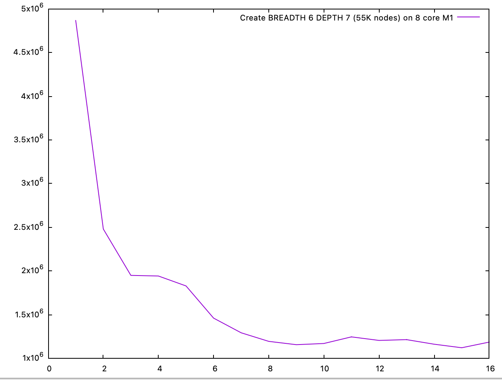

# Investigations on applying concurrency to Arkoala

## Guiding principles

  * Concurrency must be there for reason, not for the sake of concurrency
  * Concurrency must provide clearly defined and verifiable execution model, not affecting stability
  * Concurrency shall parallelize existing computations, not introduce too much new computations
  * Start with data flow, to understand theoretically feasible concurrency opportunities
  * Think in map/reduce execution scheme

## Research directions

   * Target: faster first frame
       * Concurrent UI tree building, sharding by subtrees
       * Concurrent measure
       * Concurrent layout
       * Concurrent draw of UI
   * Target: faster incremental UI updates
       * Concurrent measure, driven by locations affected by state update
       * Concurrent layout, same
       * Concurrent draw, same
   * Target: app logic execution concurrent with rendering
       * UI rendering entirely on separate thread/worker, synchronization only on state updates
       * More asynchronicity in UI tree operations
   * Target: non-intrusive smooth animations
       * External UI tree alteration source, not interacting with user states

## Prototype design

   * Use JVM to execute with shared heap to explore more chances of concurrency
   * Use Kotlin/JVM coroutines as concurrency primitives, with structural concurrency
   * Provide mock ACE backend with fixed controllable operations costs
     (node build, measure, layout, draw) to have mechanism for reliable qualitative measurements

## Qualitative measurements

Agree on several realistic benchmarking schemes:

   * Large non-lazy column of simple elements
   * Large non-lazy column of complex elements
   * Deep tree of simple elements
   * Deep tree of complex elements
   * Variants above with small, medium and large updates

This approach suggest using three statistical parameters to describe the tree in question.

   * Breadth of the tree (B)
   * Depth of the tree (D)
   * Distribution of costs of a single node (C)

For updates scenario, forth parameter is added:
   * Percentage of nodes affected by update (U)

## Results

### Concurrent tree building

Build large tree (211K nodes) with uniform graph structure (depth 5, breadth 10) on Apple M1 laptop with 8 (4+4) cores
on OpenJDK 20 JVM as function of number of concurrent workers used. Clear sweet spot around 6 cores is reached.

When breadth of tree decreases, obviously concurrency with given simple algorithm for sharding gives less benefits, i.e.
this is depth 7 breadth 6 graph.

