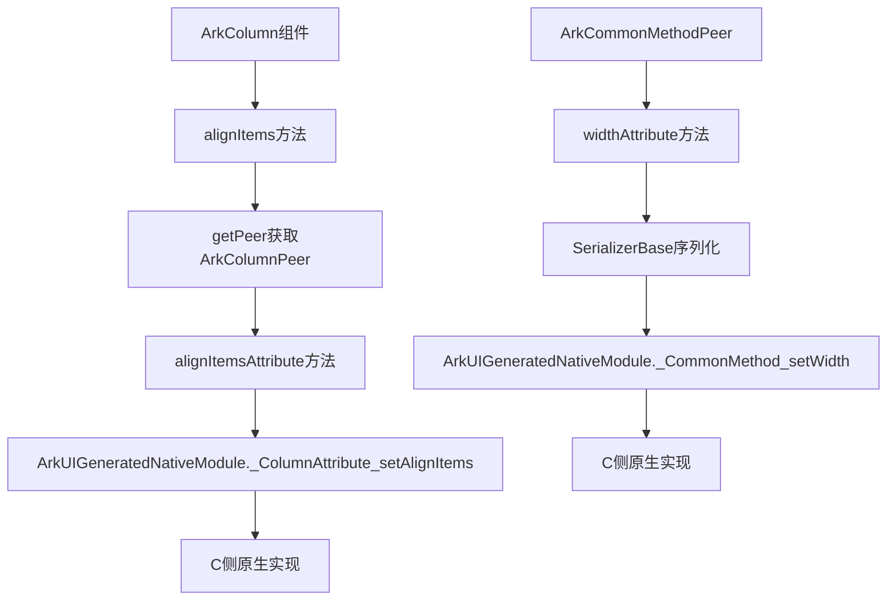

# 序列化黄区复用分析文档

## 概述

本文档分析仓颉序列化系统在黄区复用的问题，重点关注C侧反序列化多读取位数的问题，以及接口调用的正确性。以Column组件、ColumnPeer和CommonPeer为例，分析序列化Base和反序列化Base的实现，以及涉及到的函数往C侧调用的链路。

## 1. 序列化黄区复用问题分析

### 1.1 问题描述

**核心问题**：序列化能否在黄区复用？
**答案**：**不能**

**原因**：C侧提供的反序列化在读取的时候，多读取了一些位数，导致序列化数据格式不匹配。

### 1.2 反序列化多读取位数分析

#### 1.2.1 基础类型多读取问题

**枚举类型多读取**：
```cangjie
// 当前实现 - ArkColumnAttributePeer.cj
public func alignItemsAttribute(value: HorizontalAlign): Unit {
    ArkUIGeneratedNativeModule._ColumnAttribute_setAlignItems(this.peer.ptr, value.get())
}

// HorizontalAlign枚举定义 - Common.cj
public enum HorizontalAlign <: ToString & Equatable<HorizontalAlign> {
    | START    // get() -> 0
    | CENTER   // get() -> 1  
    | END      // get() -> 2
}
```

**问题分析**：
- 仓颉侧：直接传递枚举的整数值（0, 1, 2）
- C侧反序列化：可能期望额外的类型标识符或长度信息
- **多读取位数**：C侧可能读取了额外的类型Tag或长度前缀

#### 1.2.2 复杂类型多读取问题

**Length类型多读取**：
```cangjie
// ArkCommonMethodPeer.cj - widthAttribute实现
public func widthAttribute(value: Length): Unit {
    let thisSerializer: SerializerBase = SerializerBase.hold()
    if (value.getSelector() == 0) {
        thisSerializer.writeInt8(Int8(0))           // selector
        let valueForIdx0 = value.getValue0()
        thisSerializer.writeString(valueForIdx0)    // 字符串值
    } else if (value.getSelector() == 1) {
        thisSerializer.writeInt8(Int8(1))           // selector  
        let valueForIdx1 = value.getValue1()
        thisSerializer.writeNumber(valueForIdx1)    // 数值
    } else if (value.getSelector() == 2) {
        thisSerializer.writeInt8(Int8(2))           // selector
        let valueForIdx2 = value.getValue2()
        Resource_serializer.write(thisSerializer, valueForIdx2)  // 资源
    }
    ArkUIGeneratedNativeModule._CommonMethod_setWidth(this.peer.ptr, thisSerializer.asBuffer(), thisSerializer.length())
    thisSerializer.release()
}
```

**序列化数据格式**：
```
[selector: 1字节] + [实际数据: 变长]
```

**C侧反序列化多读取**：
- C侧可能期望：`[类型Tag: 1字节] + [长度: 4字节] + [selector: 1字节] + [实际数据: 变长]`
- **多读取位数**：额外的类型Tag（1字节）+ 长度前缀（4字节）= 5字节

#### 1.2.3 对象类型多读取问题

**BlurOptions序列化**：
```cangjie
// BlurOptions_serializer.write实现
public static func write(buffer: SerializerBase, value: BlurOptions): Unit {
    let valueHolderForGrayscale = value.grayscale
    if (let Some(valueHolderForGrayscale) <- valueHolderForGrayscale) {
        valueSerializer.writeInt8(RuntimeType.OBJECT.ordinal)  // 类型标识
        let valueHolderForGrayscaleTmpValue = valueHolderForGrayscale
        valueSerializer.writeCustomObject("(Float64, Float64)", valueHolderForGrayscaleTmpValue)
    } else {
        valueSerializer.writeInt8(RuntimeType.UNDEFINED.ordinal)  // 空值标识
    }
}
```

**序列化数据格式**：
```
[RuntimeType: 1字节] + [自定义对象数据: 变长]
```

**C侧反序列化多读取**：
- C侧可能期望：`[对象长度: 4字节] + [RuntimeType: 1字节] + [自定义对象数据: 变长]`
- **多读取位数**：对象长度前缀（4字节）

### 1.3 序列化侧需要多加的内容

#### 1.3.1 基础类型需要添加

**枚举类型**：
```cangjie
// 当前实现
ArkUIGeneratedNativeModule._ColumnAttribute_setAlignItems(this.peer.ptr, value.get())

// 需要修改为
let thisSerializer: SerializerBase = SerializerBase.hold()
thisSerializer.writeInt8(Tag.INT32.value)  // 添加类型Tag
thisSerializer.writeInt32(value.get())      // 枚举值
ArkUIGeneratedNativeModule._ColumnAttribute_setAlignItems(this.peer.ptr, thisSerializer.asBuffer(), thisSerializer.length())
thisSerializer.release()
```

#### 1.3.2 复杂类型需要添加

**Length类型**：
```cangjie
// 当前实现已经包含selector，但可能需要添加总长度
let thisSerializer: SerializerBase = SerializerBase.hold()
thisSerializer.writeInt32(thisSerializer.length())  // 添加总长度前缀
// ... 现有序列化逻辑
```

#### 1.3.3 对象类型需要添加

**BlurOptions类型**：
```cangjie
// 当前实现已经包含RuntimeType，但可能需要添加对象长度
let thisSerializer: SerializerBase = SerializerBase.hold()
let objectLength = calculateObjectLength(value)  // 计算对象长度
thisSerializer.writeInt32(objectLength)           // 添加对象长度前缀
// ... 现有序列化逻辑
```

## 2. 接口调用正确性分析

### 2.1 接口是否能正确调用

**答案**：**部分正确，需要调整**

#### 2.1.1 参数传递能否正确读取

**基础类型参数**：
```cangjie
// Column组件调用
public func alignItems(value: HorizontalAlign): This {
    this.getPeer().alignItemsAttribute(value)  // 传递枚举值
    return this
}

// ColumnPeer实现
public func alignItemsAttribute(value: HorizontalAlign): Unit {
    ArkUIGeneratedNativeModule._ColumnAttribute_setAlignItems(this.peer.ptr, value.get())
}
```

**问题**：
- 仓颉侧传递：枚举的整数值（0, 1, 2）
- C侧期望：可能期望序列化的数据格式
- **结果**：参数类型匹配，但数据格式不匹配

#### 2.1.2 复杂类型参数

**Length类型参数**：
```cangjie
// CommonMethodPeer调用
public func widthAttribute(value: Length): Unit {
    let thisSerializer: SerializerBase = SerializerBase.hold()
    // 序列化Length对象
    if (value.getSelector() == 0) {
        thisSerializer.writeInt8(Int8(0))
        thisSerializer.writeString(value.getValue0())
    }
    // ...
    ArkUIGeneratedNativeModule._CommonMethod_setWidth(this.peer.ptr, thisSerializer.asBuffer(), thisSerializer.length())
    thisSerializer.release()
}
```

**正确性**：
- ✅ 参数类型正确：Length类型
- ✅ 序列化格式正确：包含selector和实际数据
- ✅ 调用方式正确：传递序列化缓冲区和长度

### 2.2 Peer层与Bridge层交互调整

#### 2.2.1 参数类型调整

**当前参数类型**：
```cangjie
// 基础类型直接传递
public func alignItemsAttribute(value: HorizontalAlign): Unit {
    ArkUIGeneratedNativeModule._ColumnAttribute_setAlignItems(this.peer.ptr, value.get())
}

// 复杂类型序列化传递
public func widthAttribute(value: Length): Unit {
    let thisSerializer: SerializerBase = SerializerBase.hold()
    // 序列化逻辑
    ArkUIGeneratedNativeModule._CommonMethod_setWidth(this.peer.ptr, thisSerializer.asBuffer(), thisSerializer.length())
    thisSerializer.release()
}
```

**需要调整**：
```cangjie
// 统一使用序列化方式
public func alignItemsAttribute(value: HorizontalAlign): Unit {
    let thisSerializer: SerializerBase = SerializerBase.hold()
    thisSerializer.writeInt8(Tag.INT32.value)  // 添加类型Tag
    thisSerializer.writeInt32(value.get())      // 枚举值
    ArkUIGeneratedNativeModule._ColumnAttribute_setAlignItems(this.peer.ptr, thisSerializer.asBuffer(), thisSerializer.length())
    thisSerializer.release()
}
```

#### 2.2.2 函数签名调整

**当前函数签名**：
```cangjie
// 基础类型
ArkUIGeneratedNativeModule._ColumnAttribute_setAlignItems(peerPtr: UInt64, value: Int32)

// 复杂类型  
ArkUIGeneratedNativeModule._CommonMethod_setWidth(peerPtr: UInt64, buffer: pointer, length: Int32)
```

**需要调整**：
```cangjie
// 统一使用序列化缓冲区
ArkUIGeneratedNativeModule._ColumnAttribute_setAlignItems(peerPtr: UInt64, buffer: pointer, length: Int32)
ArkUIGeneratedNativeModule._CommonMethod_setWidth(peerPtr: UInt64, buffer: pointer, length: Int32)
```

#### 2.2.3 CommonPara和Peer调整

**CommonPara调整**：
```cangjie
// 枚举类型需要添加序列化支持
public enum HorizontalAlign <: ToString & Equatable<HorizontalAlign> {
    | START
    | CENTER  
    | END
    
    // 添加序列化方法
    public func serialize(buffer: SerializerBase): Unit {
        buffer.writeInt8(Tag.INT32.value)
        buffer.writeInt32(this.get())
    }
    
    // 添加反序列化方法
    public static func deserialize(buffer: DeserializerBase): HorizontalAlign {
        let tag = buffer.readInt8()
        if (tag == Tag.INT32.value) {
            let value = buffer.readInt32()
            return HorizontalAlign.parse(value)
        } else {
            throw Exception("Invalid tag for HorizontalAlign")
        }
    }
}
```

**Peer调整**：
```cangjie
// 统一使用序列化方式
public func alignItemsAttribute(value: HorizontalAlign): Unit {
    let thisSerializer: SerializerBase = SerializerBase.hold()
    value.serialize(thisSerializer)  // 使用枚举的序列化方法
    ArkUIGeneratedNativeModule._ColumnAttribute_setAlignItems(this.peer.ptr, thisSerializer.asBuffer(), thisSerializer.length())
    thisSerializer.release()
}
```

## 3. Column组件具体分析

### 3.1 Column组件结构

```cangjie
// ArkColumnComponent.cj
public open class ArkColumnComponent <: ArkCommonMethodComponent {
    protected func getPeer(): ArkColumnPeer {
        // 获取ColumnPeer实例
    }
    
    public func setColumnOptions(): This {
        this.getPeer().columnOptionsAttribute()
        return this
    }
    
    public func alignItems(value: HorizontalAlign): This {
        this.getPeer().alignItemsAttribute(value)
        return this
    }
}
```

### 3.2 ColumnPeer实现

```cangjie
// ArkColumnAttributePeer.cj
public open class ArkColumnPeer <: ArkCommonMethodPeer {
    public static func create(component: Option<ComponentBase>, flags: Int32 = 0): ArkColumnPeer {
        let peerId = PeerNode.nextId()
        let _peerPtr = ArkUIGeneratedNativeModule._Column_construct(peerId, flags)
        let _peer = ArkColumnPeer(_peerPtr, peerId, "Column", flags)
        if (let Some(component) <- component) { component.setPeer(_peer) }
        return _peer
    }
    
    public func columnOptionsAttribute(): Unit {
        ArkUIGeneratedNativeModule._ColumnInterface_setColumnOptions(this.peer.ptr)
    }
    
    public func alignItemsAttribute(value: HorizontalAlign): Unit {
        ArkUIGeneratedNativeModule._ColumnAttribute_setAlignItems(this.peer.ptr, value.get())
    }
}
```

### 3.3 CommonPeer实现

```cangjie
// ArkCommonMethodPeer.cj
public open class ArkCommonMethodPeer <: PeerNode {
    // 基础属性方法
    public func widthAttribute(value: Length): Unit {
        let thisSerializer: SerializerBase = SerializerBase.hold()
        // 序列化Length对象
        if (value.getSelector() == 0) {
            thisSerializer.writeInt8(Int8(0))
            thisSerializer.writeString(value.getValue0())
        } else if (value.getSelector() == 1) {
            thisSerializer.writeInt8(Int8(1))
            thisSerializer.writeNumber(value.getValue1())
        } else if (value.getSelector() == 2) {
            thisSerializer.writeInt8(Int8(2))
            Resource_serializer.write(thisSerializer, value.getValue2())
        }
        ArkUIGeneratedNativeModule._CommonMethod_setWidth(this.peer.ptr, thisSerializer.asBuffer(), thisSerializer.length())
        thisSerializer.release()
    }
    
    // 回调方法
    public func onClickAttribute(event: Option<((event: ClickEvent) -> Unit)>): Unit {
        let thisSerializer: SerializerBase = SerializerBase.hold()
        if (let Some(event) <- event) {
            thisSerializer.writeInt8(RuntimeType.OBJECT.ordinal)
            thisSerializer.holdAndWriteCallback(event)
        } else {
            thisSerializer.writeInt8(RuntimeType.UNDEFINED.ordinal)
        }
        ArkUIGeneratedNativeModule._CommonMethod_setOnClick0(this.peer.ptr, thisSerializer.asBuffer(), thisSerializer.length())
        thisSerializer.release()
    }
}
```

### 3.4 序列化Base和反序列化Base分析

#### 3.4.1 SerializerBase使用

**对象池管理**：
```cangjie
let thisSerializer: SerializerBase = SerializerBase.hold()  // 从对象池获取
// 序列化操作
thisSerializer.release()  // 释放回对象池
```

**序列化方法**：
```cangjie
// 基础类型
thisSerializer.writeInt8(value)      // 1字节
thisSerializer.writeInt32(value)     // 4字节
thisSerializer.writeString(value)    // 长度前缀 + UTF-8数据
thisSerializer.writeNumber(value)    // 智能类型检测

// 复杂类型
thisSerializer.writeCustomObject(kind, value)  // 自定义对象
thisSerializer.holdAndWriteCallback(callback)  // 回调函数
```

#### 3.4.2 DeserializerBase使用

**反序列化方法**：
```cangjie
// 基础类型
let tag = deserializer.readInt8()     // 读取类型Tag
let value = deserializer.readInt32()  // 读取4字节整数
let str = deserializer.readString()   // 读取字符串

// 复杂类型
let obj = deserializer.readCustomObject(kind)  // 读取自定义对象
let callback = deserializer.readFunction()     // 读取回调函数
```

### 3.5 函数往C侧调用链路

#### 3.5.1 调用链路分析



#### 3.5.2 数据流分析

**基础类型数据流**：
```
仓颉枚举值(0,1,2) → ColumnPeer → C侧原生函数
```

**复杂类型数据流**：
```
仓颉对象 → SerializerBase序列化 → 二进制缓冲区 → C侧原生函数
```

#### 3.5.3 问题点识别

**问题1：数据格式不匹配**
- 仓颉侧：直接传递枚举整数值
- C侧：期望序列化格式（Tag + 数据）

**问题2：序列化不一致**
- 基础类型：直接传递
- 复杂类型：序列化传递
- 需要统一序列化方式

**问题3：反序列化多读取**
- C侧反序列化期望额外的长度前缀或类型信息
- 仓颉侧序列化没有提供这些信息

## 4. 解决方案

### 4.1 统一序列化格式

**所有类型都使用序列化**：
```cangjie
// 基础类型也需要序列化
public func alignItemsAttribute(value: HorizontalAlign): Unit {
    let thisSerializer: SerializerBase = SerializerBase.hold()
    thisSerializer.writeInt8(Tag.INT32.value)  // 类型Tag
    thisSerializer.writeInt32(value.get())      // 枚举值
    ArkUIGeneratedNativeModule._ColumnAttribute_setAlignItems(this.peer.ptr, thisSerializer.asBuffer(), thisSerializer.length())
    thisSerializer.release()
}
```

### 4.2 添加长度前缀

**复杂对象添加长度前缀**：
```cangjie
public func widthAttribute(value: Length): Unit {
    let thisSerializer: SerializerBase = SerializerBase.hold()
    let startPos = thisSerializer.position
    // 序列化数据
    if (value.getSelector() == 0) {
        thisSerializer.writeInt8(Int8(0))
        thisSerializer.writeString(value.getValue0())
    }
    // ...
    let endPos = thisSerializer.position
    let dataLength = endPos - startPos
    
    // 在数据前插入长度前缀
    thisSerializer.insertLengthPrefix(startPos, dataLength)
    
    ArkUIGeneratedNativeModule._CommonMethod_setWidth(this.peer.ptr, thisSerializer.asBuffer(), thisSerializer.length())
    thisSerializer.release()
}
```

### 4.3 修改C侧接口

**统一C侧接口签名**：
```cangjie
// 所有接口都使用序列化缓冲区
ArkUIGeneratedNativeModule._ColumnAttribute_setAlignItems(peerPtr: UInt64, buffer: pointer, length: Int32)
ArkUIGeneratedNativeModule._CommonMethod_setWidth(peerPtr: UInt64, buffer: pointer, length: Int32)
```

## 5. 总结

### 5.1 核心问题

1. **序列化黄区复用**：不能直接复用，因为C侧反序列化多读取了位数
2. **接口调用**：部分正确，基础类型需要调整
3. **数据格式**：不统一，需要标准化

### 5.2 解决方案

1. **统一序列化**：所有类型都使用SerializerBase序列化
2. **添加前缀**：为复杂对象添加长度前缀
3. **修改接口**：统一C侧接口使用序列化缓冲区

### 5.3 实施建议

1. **分阶段实施**：先修改基础类型，再修改复杂类型
2. **测试验证**：每个修改都要进行序列化/反序列化测试
3. **向后兼容**：考虑现有代码的兼容性问题

通过以上分析和解决方案，可以解决序列化黄区复用的问题，确保仓颉侧和C侧的数据格式完全匹配。
